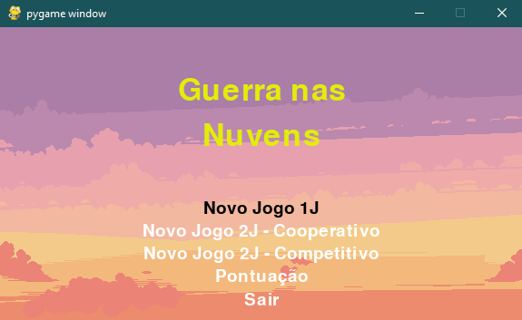
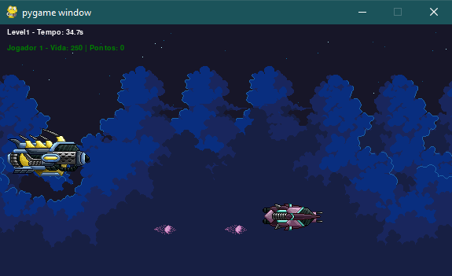
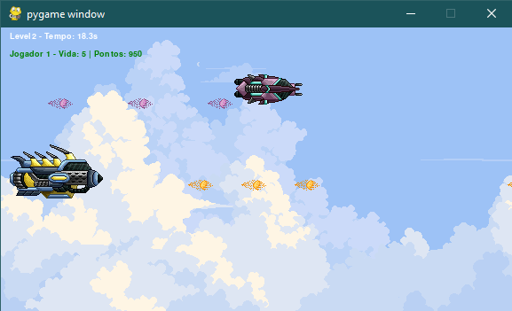
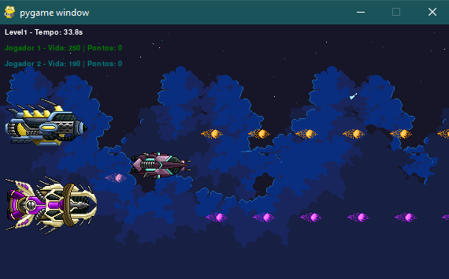
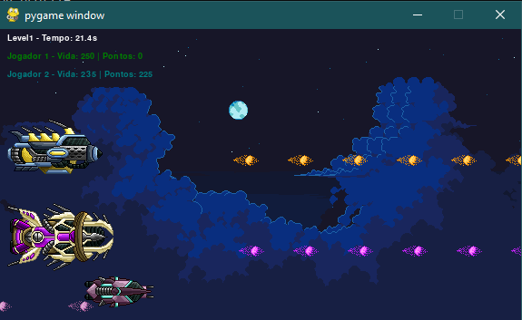
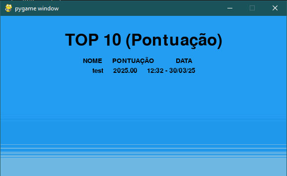

 War in the Clouds 
===============
 

### About

Mountain Shooter is a 2D arcade game developed with Pygame. The game has 2 levels and each level level end with a timeout event.
Can be played coop (2 players).
Score is saved in database (SQLite3))

### Feel free if you want to contribute.

GAME MENU

GAME LEVEL 1

GAME LEVEL 2

GAME LEVEL 1 COOPERATIVE

GAME LEVEL 1 COMPETITIVE

GAME SCORE

